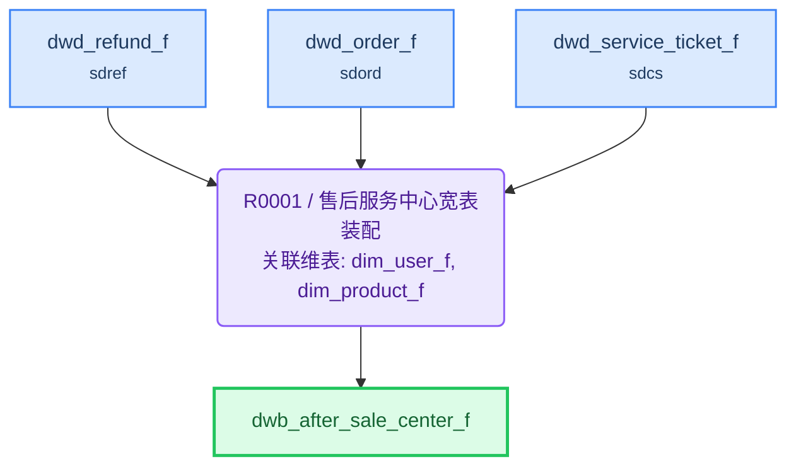

# ETL 技术规格(TS)

> 目标表: `slas.dwb_after_sale_center_f`(售后服务中心宽表) - 生成 2026-08-04T22:17:30

---

## 1. 概述

| 项目 | 内容 |
|------|------|
| **F 表** | `slas.dwb_after_sale_center_f`（售后服务中心宽表） |
| **I 视图** | `slas.dwb_after_sale_center_i`（F表镜像，对外查询） |
| **业务主键** | refund_id |
| **写入策略** | 全量（可随时重刷） |
| **字段统计** | 24 |
| **规则数** | 1 |

**来源表**:

| # | 表名 | 中文名 | 别名 |
|---|------|--------|------|
| 1 | sdref.dwd_refund_f | 退款事实表 | drf |
| 2 | sdord.dwd_order_f | 订单明细事实表 | dof |
| 3 | dim.dim_user_f | 用户维度表 | duf |
| 4 | dim.dim_product_f | 商品维度表 | dpf |
| 5 | sdcs.dwd_service_ticket_f | 工单事实表 | dst |

---

## 2. 表模型设计

| 表名 | 类型 | 分布 | 分区 | 字段数 | 说明 |
|------|------|------|------|--------|------|
| `dwb_after_sale_center_f` | 目标F表 | HASH(refund_id) | — | 24 | 售后服务中心宽表 |
| `dwb_after_sale_center_i` | 直封视图 | — | — | 同F表 | F表镜像，对外查询 |

---

## 3. 复杂度分析与分段决策

| 因素 | 值 | 阈值 |
|------|-----|------|
| JOIN 表数量 | 4 | >12 触发分段 |
| 粒度变化 | 无 | 有即评估分段 |
| 多步骤加工字段 | 2 | ≥5 触发分段 |
| 聚合后关联 | 否 | 是即评估分段 |

**分段结论**: **不分段**

> 4 个 JOIN 远低于 12 阈值；无粒度变化（退款粒度进→退款粒度出）；2 个加工字段（process_days/refund_rate）为内联单步表达式（码值映射/简单运算），无需先聚合再关联；单条 INSERT 可一次写对，不建中间表

---

## 4. 规则详情

### R0001 - 售后服务中心宽表装配

| 项目 | 内容 |
|------|------|
| 执行序 | 1 |
| 产出表 | `dwb_after_sale_center_f` |
| 写入方式 | truncate_table |
| 设计意图 | 以退款事实表为主表，左关联订单/用户/商品/工单四表，一次性拼装售后服务中心宽表全量字段；单场景全量覆盖，无分段 |
| 字段数 | 24 |

**关联风险**:

- `dwd_order_f`: 若 order_id 在订单明细表不唯一（多商品行），需先按 order_id 聚合到订单粒度（取订单号、汇总实付金额）再关联，避免退款行发散
- `dwd_service_ticket_f`: 若一个退款存在多张工单，取最新一条有效工单（按工单创建时间倒序取首条），保证每个退款 1:1 关联

**字段逻辑**:

- `refund_type_name`: 退款类型码值转换：ONLY_REFUND→仅退款，RETURN_REFUND→退货退款，EXCHANGE→换货，其余→其他
- `refund_status_name`: 退款状态码值转换：APPLYING→申请中，APPROVED→已同意，SUCCESS→退款成功，REJECTED→已拒绝，其余→其他
- `ticket_status_name`: 工单状态码值转换：PENDING→待处理，PROCESSING→处理中，RESOLVED→已解决，CLOSED→已关闭，其余→其他
- `process_days`: 处理天数=完成时间与申请时间相差天数；完成时间为空时按当天计算（COALESCE 兜底当前日期）
- `refund_rate`: 退款比例(%)=退款金额 / 订单实付金额 × 100；订单实付金额为空或为0时需防除零

---

## 5. 数据流向

---

## 6. 调度配置

### F 表调度

| 配置项 | 值 |
|--------|-----|
| 调度任务 | dw_slas_dwb_after_sale_center_f |
| 调度周期 | 0 30 3 * * ? |

**LTS 参数**:

| LTS 变量 | 赋值给 ETL 参数 | 说明 |
|----------|----------------|------|
| V_CYCLE_ID | P_CYCLE_ID | 批次号 |
| V_GROUP_CODE | — | 规则组编码 |

### I 视图调度

| 配置项 | 值 |
|--------|-----|
| 调度任务 | dw_slas_dwb_after_sale_center_i |
| 调度周期 | 0 35 3 * * ? |

**上游依赖**:

| 源表 | 调度任务 |
|------|---------|
| dwb_after_sale_center_f | dw_slas_dwb_after_sale_center_f |

---

## 7. 数据质量检查(DQ)

*(本表无 DQ 要求)*
