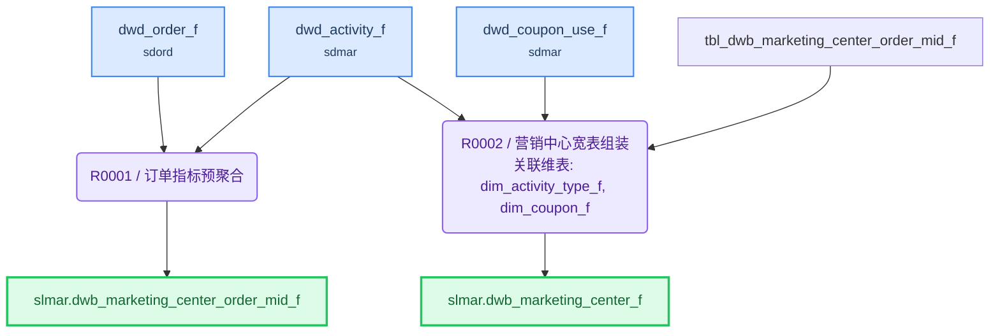

# ETL 技术规格(TS)

> 目标表: `slmar.dwb_marketing_center_f`(营销中心宽表) - 生成 2026-08-04T23:04:39

---

## 1. 概述

| 项目 | 内容 |
|------|------|
| **F 表** | `slmar.dwb_marketing_center_f`（营销中心宽表） |
| **I 视图** | `slmar.dwb_marketing_center_i`（F表镜像，对外查询） |
| **业务主键** | activity_id |
| **写入策略** | 全量（可随时重刷） |
| **字段统计** | 29 |
| **规则数** | 2 |

**来源表**:

| # | 表名 | 中文名 | 别名 |
|---|------|--------|------|
| 1 | sdmar.dwd_activity_f | 活动事实表 | daf |
| 2 | dim.dim_activity_type_f | 活动类型维度表 | dat |
| 3 | dim.dim_coupon_f | 优惠券维度表 | dcf |
| 4 | sdmar.dwd_coupon_use_f | 优惠券使用事实表 | dcu |
| 5 | sdord.dwd_order_f | 订单明细事实表 | dof |

---

## 2. 表模型设计

| 表名 | 类型 | 分布 | 分区 | 字段数 | 说明 |
|------|------|------|------|--------|------|
| `dwb_marketing_center_f` | 目标F表 | HASH(activity_id) | — | 24 | 营销中心宽表 |
| `dwb_marketing_center_order_mid_f` | 中间表 | HASH(activity_id) | — | 5 | 按 activity_id 预聚合订单指标(订单数/GMV/… |
| `dwb_marketing_center_i` | 直封视图 | — | — | 同F表 | F表镜像，对外查询 |

---

## 3. 复杂度分析与分段决策

| 因素 | 值 | 阈值 |
|------|-----|------|
| JOIN 表数量 | 5 | >12 触发分段 |
| 粒度变化 | 有 | 有即评估分段 |
| 多步骤加工字段 | 6 | ≥5 触发分段 |
| 聚合后关联 | 是 | 是即评估分段 |

> 粒度变化说明: dwd_order_f 多行(每笔订单一行)聚合为一行(每个活动一行), 在订单中间表 dwb_marketing_center_order_mid_f 中按 activity_id GROUP BY 完成收敛

**分段结论**: **分段**

> 命中分段阈值: 多步骤加工字段6个(order_cnt/gmv_amount/participant_cnt/total_discount_amount/new_user_rate/activity_roi, 均≥5阈值); 且存在聚合后关联(订单表先 GROUP BY 再 JOIN 主查询)。 建物理中间表 dwb_marketing_center_order_mid_f 收口订单聚合, 防止主查询 JOIN 订单表发散。

---

## 4. 规则详情

### R0001 - 订单指标预聚合

| 项目 | 内容 |
|------|------|
| 执行序 | 1 |
| 产出表 | `slmar.dwb_marketing_center_order_mid_f` |
| 写入方式 | truncate_table |
| 设计意图 | 按 activity_id 预聚合订单指标(订单数/GMV/参与人数/优惠金额/新客占比), 将 dwd_order_f 多行(每笔订单)收敛为一行(每个活动), 防止主查询关联订单表时发散。中间表粒度=每行一个活动, 以 activity_id 为聚合键(隐式粒度键, 非 field_targets 所属)。 |
| 字段数 | 5 |

**字段逻辑**:

- `order_cnt`: 按 activity_id 汇总活动关联订单数, 对 dwd_order_f 中该活动下的订单行计数
- `gmv_amount`: 按 activity_id 汇总活动 GMV, 对 dwd_order_f 中该活动下所有订单的 pay_amount 求和
- `participant_cnt`: 按 activity_id 统计参与人数, 对 dwd_order_f 中该活动下订单的 user_id 去重计数
- `total_discount_amount`: 按 activity_id 汇总活动优惠金额, 对 dwd_order_f 中该活动下所有订单的 discount_amount 求和
- `new_user_rate`: 新客占比百分比。分子=活动期间新用户产生的订单数, 分母=活动总订单数, 比值乘100。 新用户定义: 用户的全量历史首单时间落在该活动的开始至结束时间窗口内(即活动期间首次下单的用户)。 判定方式: 先用子查询找出每个 user_id 的历史首单时间(MIN 下单时间), 再筛选首单时间在活动 [start_time, end_time] 窗口内的用户, 统计这些用户在该活动中的订单数。总订单数为0时结果为NULL。 需关联 dwd_activity_f 取活动时间窗口。

---

### R0002 - 营销中心宽表组装

| 项目 | 内容 |
|------|------|
| 执行序 | 2 |
| 产出表 | `slmar.dwb_marketing_center_f` |
| 写入方式 | truncate_table |
| 设计意图 | 以活动事实表(dwd_activity_f)为主表, LEFT JOIN 活动类型维度、优惠券维度和订单聚合中间表, 组装营销中心宽表全部字段。枚举翻译、比率指标、人均消费、ROI 在此规则完成。 订单相关指标全部取自 R0001 中间表, 不再直接关联订单明细表。 |
| 字段数 | 24 |

**关联风险**:

- `dim_coupon_f`: 需确认 activity_id 在 dim_coupon_f 中是否唯一; 若一活动多券则需收敛(取主券或聚合)
- `dwd_coupon_use_f`: CTE 预聚合: 按 activity_id GROUP BY 汇总优惠券核销金额后关联

**字段逻辑**:

- `activity_type_name`: 活动类型枚举翻译: SECKILL→秒杀, GROUPBUY→团购, PRESALE→预售, FULL_REDUCE→满减, FULL_GIFT→满赠, 其余→其他
- `activity_status_name`: 活动状态枚举翻译: DRAFT→草稿, PENDING→待开始, RUNNING→进行中, ENDED→已结束, 其余→其他
- `activity_days`: 活动持续天数, 结束时间减去开始时间的天数差(DATEDIFF)
- `coupon_type_name`: 优惠券类型枚举翻译: FULL_REDUCE→满减券, DISCOUNT→折扣券, CASH→现金券, 其余→其他
- `coupon_use_rate`: 优惠券使用率百分比, 已使用量除以发放总量再乘以100, 发放总量为0时结果为NULL
- `avg_order_amount`: 人均消费, 活动GMV除以参与人数, 参与人数为0时结果为NULL(GMV和参与人数均取自订单中间表)
- `activity_roi`: 活动ROI百分比, 计算公式: ROI = (活动GMV - 活动成本) / 活动成本 * 100。 活动成本 = 优惠券核销金额 + 满减优惠金额 + 运营成本。 各成分来源: 活动GMV取自订单中间表 gmv_amount; 满减优惠金额取自订单中间表 total_discount_amount; 优惠券核销金额取自优惠券使用事实表(dwd_coupon_use_f)按 activity_id 汇总(经 CTE 预聚合); 运营成本来源待确认(见 design_notes DN002)。活动成本为0时结果为NULL。

---

## 5. 数据流向

---

## 6. 调度配置

### F 表调度

| 配置项 | 值 |
|--------|-----|
| 调度任务 | dwb_marketing_center_f |
| 调度周期 | 0 30 2 * * ? |

**LTS 参数**:

| LTS 变量 | 赋值给 ETL 参数 | 说明 |
|----------|----------------|------|
| V_CYCLE_ID | P_CYCLE_ID | 批次号 |
| V_GROUP_CODE | — | 规则组编码 |

### I 视图调度

| 配置项 | 值 |
|--------|-----|
| 调度任务 | dwb_marketing_center_i |
| 调度周期 | 0 0 3 * * ? |

**上游依赖**:

| 源表 | 调度任务 |
|------|---------|
| dwb_marketing_center_f | dwb_marketing_center_f |

---

## 7. 数据质量检查(DQ)

*(本表无 DQ 要求)*
