# ETL 技术规格(TS)

> 目标表: `slord.dwb_order_center_f`(订单中心宽表) - 生成 2026-08-04T23:20:38

---

## 1. 概述

| 项目 | 内容 |
|------|------|
| **F 表** | `slord.dwb_order_center_f`（订单中心宽表） |
| **I 视图** | `slord.dwb_order_center_i`（F表镜像，对外查询） |
| **业务主键** | order_id |
| **写入策略** | 全量（可随时重刷） |
| **字段统计** | 150 |
| **规则数** | 3 |

**来源表**:

| # | 表名 | 中文名 | 别名 |
|---|------|--------|------|
| 1 | sdord.dwd_order_f | 订单明细事实表 | dof |
| 2 | sdord.dwd_order_detail_f | 订单商品明细事实表 | dod |
| 3 | sdpay.dwd_payment_f | 支付事实表 | dpf |
| 4 | sdlog.dwd_logistics_f | 物流事实表 | dlf |
| 5 | sdmar.dwd_coupon_use_f | 优惠券使用事实表 | dcu |
| 6 | dim.dim_user_f | 用户维度表 | duf |
| 7 | dim.dim_user_level_f | 用户等级维度表 | dul |
| 8 | dim.dim_product_f | 商品维度表 | dpf7 |
| 9 | dim.dim_product_category_f | 商品分类维度表 | dpc |
| 10 | dim.dim_brand_f | 品牌维度表 | dbf |
| 11 | dim.dim_shop_f | 店铺维度表 | dsf |
| 12 | dim.dim_region_f | 地区维度表 | drf |
| 13 | dim.dim_warehouse_f | 仓库维度表 | dwf |
| 14 | dim.dim_payment_method_f | 支付方式维度表 | dpm |
| 15 | dim.dim_logistics_company_f | 物流公司维度表 | dlc |
| 16 | dim.dim_coupon_f | 优惠券维度表 | dcf |
| 17 | dim.dim_activity_f | 营销活动维度表 | daf |
| 18 | sdref.dwd_refund_f | 退款事实表 | drf17 |

---

## 2. 表模型设计

| 表名 | 类型 | 分布 | 分区 | 字段数 | 说明 |
|------|------|------|------|--------|------|
| `dwb_order_center_f` | 目标F表 | HASH(order_id) | — | 136 | 订单中心宽表 |
| `dwb_order_center_tmp1` | 中间表 | HASH(user_id) | — | 12 | 将订单、支付、优惠券、退款四类事实表按 user_id 聚合 |
| `dwb_order_center_tmp2` | 中间表 | HASH(product_id) | — | 2 | 将订单商品明细按 product_id 聚合 |
| `dwb_order_center_i` | 直封视图 | — | — | 同F表 | F表镜像，对外查询 |

---

## 3. 复杂度分析与分段决策

| 因素 | 值 | 阈值 |
|------|-----|------|
| JOIN 表数量 | 18 | >12 触发分段 |
| 粒度变化 | 有 | 有即评估分段 |
| 多步骤加工字段 | 17 | ≥5 触发分段 |
| 聚合后关联 | 是 | 是即评估分段 |

> 粒度变化说明: 用户画像（tmp1）和商品画像（tmp2）在用户/商品粒度聚合后关联回订单粒度；店铺历史订单数在店铺粒度聚合后关联回订单粒度

**分段结论**: **分段**

> JOIN 表数18（超12阈值）、多步骤聚合字段17（超5阈值）、存在跨粒度聚合（用户/商品/店铺三种非订单粒度），需建2张物理中间表收口聚合逻辑，避免主装配阶段反复聚合导致粒度发散和SQL过于复杂

---

## 4. 规则详情

### R0001 - 用户画像汇总

| 项目 | 内容 |
|------|------|
| 执行序 | 1 |
| 产出表 | `slord.dwb_order_center_tmp1` |
| 写入方式 | truncate_table |
| 设计意图 | 将订单、支付、优惠券、退款四类事实表按 user_id 聚合，产出用户级画像指标（首次/最近下单、历史消费、RFM分层、复购、偏好），避免主装配阶段聚合导致粒度发散 |
| 字段数 | 12 |

**字段逻辑**:

- `first_order_time`: 从 dwd_order_f 按 user_id 分组，取 MIN(create_time) 作为首次下单时间
- `last_order_time`: 从 dwd_order_f 按 user_id 分组，取 MAX(create_time) 作为最近下单时间
- `history_order_cnt`: 从 dwd_order_f 按 user_id 分组，COUNT(*) 统计历史订单总数
- `history_pay_amount`: 从 dwd_order_f 按 user_id 分组，SUM(pay_amount) 汇总历史实付金额
- `history_discount_amount`: 从 dwd_order_f 按 user_id 分组，SUM(discount_amount) 汇总历史优惠金额
- `avg_order_amount`: 历史消费金额 / 历史订单数，计算平均客单价
- `rfm_segment`: 根据最近下单时间计算R值(1-5分)、历史订单数计算F值(1-5分)、历史消费金额计算M值(1-5分)，三分量组合输出RFM分层标签
- `is_repeat_user`: 历史订单数 >= 2 则为复购用户(Y)，否则非复购(N)
- `fav_pay_method`: 从 dwd_payment_f 按 user_id 分组，取 COUNT 最多的 pay_method 作为用户常用支付方式
- `user_coupon_used_cnt`: 从 dwd_coupon_use_f 按 user_id 分组，COUNT(DISTINCT coupon_id) 统计用户使用优惠券次数
- `user_fav_activity_type`: 从 dwd_order_f 按 user_id 关联活动维表，取参与订单数最多的活动类型作为偏好活动类型
- `user_refund_cnt`: 从 dwd_refund_f 按 user_id 分组，COUNT(*) 统计历史退款成功次数

---

### R0002 - 商品画像汇总

| 项目 | 内容 |
|------|------|
| 执行序 | 2 |
| 产出表 | `slord.dwb_order_center_tmp2` |
| 写入方式 | truncate_table |
| 设计意图 | 将订单商品明细按 product_id 聚合，产出商品累计销量和销售额，供主表装配时 LEFT JOIN |
| 字段数 | 2 |

**字段逻辑**:

- `product_sales_cnt`: 从 dwd_order_detail_f 按 product_id 分组，SUM(qty) 统计商品累计销量
- `product_sales_amount`: 从 dwd_order_detail_f 按 product_id 分组，SUM(real_price * qty) 统计商品累计销售额

---

### R0003 - 订单中心宽表装配

| 项目 | 内容 |
|------|------|
| 执行序 | 3 |
| 产出表 | `slord.dwb_order_center_f` |
| 写入方式 | truncate_table |
| 设计意图 | 以 dwd_order_f 为驱动表，LEFT JOIN 订单明细/支付/物流/优惠券/退款事实表（各取一条有效记录）+ 全部维表 + tmp1用户画像 + tmp2商品画像，一次性装配宽表全部字段 |
| 字段数 | 136 |

**关联风险**:

- `dwd_order_detail_f`: ROW_NUMBER() OVER(PARTITION BY order_id ORDER BY ... ) 取 rn=1，保证一个订单只取第一条商品
- `dwd_payment_f`: ROW_NUMBER() OVER(PARTITION BY order_id ORDER BY pay_time DESC) 取 rn=1，取最新一条成功支付
- `dwd_logistics_f`: ROW_NUMBER() OVER(PARTITION BY order_id ORDER BY ship_time DESC) 取 rn=1，取最新物流
- `dwd_coupon_use_f`: ROW_NUMBER() OVER(PARTITION BY order_id ORDER BY ... ) 取 rn=1 或 GROUP BY 收敛
- `dwd_refund_f`: ROW_NUMBER() OVER(PARTITION BY order_id ORDER BY complete_time DESC) 取 rn=1 或取最新退款

**字段逻辑**:

- `order_status_name`: CASE 映射订单状态码为中文：PAID→已支付、SHIPPED→已发货、RECEIVED→已签收、CANCELLED→已取消，其余→其他
- `order_source_name`: CASE 映射订单来源码为中文：APP→APP端、WEB→网页端、MINIAPP→小程序、H5→H5页面，其余→其他
- `order_type_name`: CASE 映射订单类型码为中文：NORMAL→普通订单、PRESALE→预售订单、GROUPBUY→团购订单、SECKILL→秒杀订单，其余→其他
- `order_date`: DATE_FORMAT 取 create_time 的日期部分（YYYY-MM-DD）
- `user_phone_masked`: 手机号脱敏：保留前3位和后4位，中间用****替代
- `user_email_masked`: 邮箱脱敏：保留前2位和@后域名，中间用***替代
- `gender_name`: CASE 映射性别码为中文：M→男、F→女，其余→未知
- `user_age`: 当前年份 YEAR(CURDATE()) 减去出生年份 YEAR(birthday)
- `user_source_name`: CASE 映射用户来源码为中文：NATURAL→自然流量、AD→广告投放、REFERRAL→推荐注册、ACTIVITY→活动引流，其余→其他
- `user_days`: DATEDIFF 计算当前日期 CURDATE() 与注册时间的天数差
- `category_l2_id`: 商品维表 category_id 关联一级类目，再通过 parent_id 关联取二级类目ID
- `category_l2_name`: 通过二级类目ID关联 dim_product_category_f 取 category_name
- `category_l3_id`: 商品维表经二级类目，再通过 parent_id 关联取三级类目ID
- `category_l3_name`: 通过三级类目ID关联 dim_product_category_f 取 category_name
- `product_status_name`: CASE 映射商品状态码为中文：ON_SHELF→上架、OFF_SHELF→下架、SOLD_OUT→售罄，其余→其他
- `product_profit`: 商品售价 sale_price 减去成本价 cost_price
- `shop_type_name`: CASE 映射店铺类型码为中文：FLAGSHIP→旗舰店、SPECIALTY→专卖店、FRANCHISE→专营店、OFFICIAL→官方店，其余→其他
- `shop_level_name`: 拼接 'Lv.' 前缀和店铺等级数字
- `shop_province_name`: 店铺维表 province_code 关联 dim_region_f 取省份名称
- `shop_city_name`: 店铺维表 city_code 关联 dim_region_f 取城市名称
- `shop_history_order_cnt`: 从 dwd_order_f 按 shop_id 分组 COUNT(*) 统计店铺历史订单数（CTE内联聚合后关联）
- `receiver_phone_masked`: 收货人手机号脱敏：保留前3位和后4位，中间用****替代
- `receiver_city_name`: 订单 city_code 关联 dim_region_f 取城市名称
- `receiver_district_name`: 订单 district_code 关联 dim_region_f 取区县名称
- `full_address`: 拼接收货省份名称+城市名称+区县名称+街道+详细地址
- `address_tag_name`: CASE 映射地址标签码为中文：HOME→家、COMPANY→公司、SCHOOL→学校，其余→其他
- `pay_channel_name`: 支付方式维表关联支付渠道表取 channel_name（复杂关联链）
- `pay_status_name`: CASE 映射支付状态码为中文：SUCCESS→支付成功、FAILED→支付失败、PENDING→支付中，其余→未知
- `bank_card_masked`: 银行卡号脱敏：只保留后4位，前缀用****替代
- `pay_duration_minutes`: 支付时间 pay_time 减去下单时间 order_time，换算为分钟
- `logistics_type_name`: 物流公司维表关联物流类型维度取 type_name（复杂关联链）
- `warehouse_address`: 仓库维表关联地区维表取仓库地址（复杂关联链）
- `logistics_status_name`: CASE 映射物流状态码为中文：PENDING→待发货、SHIPPED→已发货、IN_TRANSIT→运输中、DELIVERED→已签收，其余→其他
- `ship_duration_hours`: 发货时间 ship_time 减去支付时间 pay_time，换算为小时
- `coupon_type_name`: CASE 映射优惠券类型码为中文：FULL_REDUCE→满减券、DISCOUNT→折扣券、CASH→现金券、FREIGHT→运费券，其余→其他
- `activity_type_name`: CASE 映射活动类型码为中文：SECKILL→秒杀活动、GROUPBUY→团购活动、PRESALE→预售活动、FULL_GIFT→满赠活动、FULL_REDUCE→满减活动，其余→其他
- `is_marketing_order`: 判断是否存在优惠券ID或活动ID，有则为营销订单(Y)，否则非营销(N)
- `total_discount_amount`: 优惠券金额 + 满减金额 + 积分抵扣金额汇总
- `refund_type_name`: CASE 映射退款类型码为中文：ONLY_REFUND→仅退款、RETURN_REFUND→退货退款、EXCHANGE→换货，其余→其他
- `refund_status_name`: CASE 映射退款状态码为中文：APPLYING→申请中、APPROVED→已同意、SUCCESS→退款成功、REJECTED→已拒绝，其余→其他
- `is_refund_order`: 判断是否存在退款ID，有则为退款订单(Y)，否则非退款(N)
- `delivery_days`: DATEDIFF 签收时间 receive_time 减去发货时间 ship_time

---

## 5. 数据流向

```mermaid
flowchart TD

  step_R0001("R0001 / 用户画像汇总")
  src_dwd_order_f["dwd_order_f<br/><small>sdord</small>"]
  src_dwd_payment_f["dwd_payment_f<br/><small>sdpay</small>"]
  src_dwd_coupon_use_f["dwd_coupon_use_f<br/><small>sdmar</small>"]
  src_dwd_refund_f["dwd_refund_f<br/><small>sdref</small>"]
  tbl_slord_dwb_order_center_tmp1["slord.dwb_order_center_tmp1"]
  step_R0002("R0002 / 商品画像汇总")
  src_dwd_order_detail_f["dwd_order_detail_f<br/><small>sdord</small>"]
  tbl_slord_dwb_order_center_tmp2["slord.dwb_order_center_tmp2"]

  step_R0003("R0003 / 订单中心宽表装配<br/>关联维表: dim_user_f, dim_user_level_f, dim_product_f, dim_product_category_f 等12张")
  src_dwd_logistics_f["dwd_logistics_f<br/><small>sdlog</small>"]
  tbl_slord_dwb_order_center_f["slord.dwb_order_center_f"]

  src_dwd_order_f --> step_R0001
  src_dwd_payment_f --> step_R0001
  src_dwd_coupon_use_f --> step_R0001
  src_dwd_refund_f --> step_R0001
  step_R0001 --> tbl_slord_dwb_order_center_tmp1
  src_dwd_order_detail_f --> step_R0002
  step_R0002 --> tbl_slord_dwb_order_center_tmp2
  src_dwd_order_f --> step_R0003
  src_dwd_order_detail_f --> step_R0003
  src_dwd_payment_f --> step_R0003
  src_dwd_logistics_f --> step_R0003
  src_dwd_coupon_use_f --> step_R0003
  src_dwd_refund_f --> step_R0003
  step_R0003 --> tbl_slord_dwb_order_center_f
  tbl_dwb_order_center_tmp1 --> step_R0003
  tbl_dwb_order_center_tmp2 --> step_R0003

  classDef source fill:#dbeafe,stroke:#3b82f6,stroke-width:1.5px,color:#1e3a5f
  classDef step fill:#ede9fe,stroke:#8b5cf6,stroke-width:1.5px,color:#4c1d95
  classDef intermediate fill:#f1f5f9,stroke:#64748b,stroke-width:1.5px,color:#334155,stroke-dasharray:5 3
  classDef target fill:#dcfce7,stroke:#22c55e,stroke-width:2.5px,color:#166534
  classDef view fill:#e0e7ff,stroke:#6366f1,stroke-width:1.5px,color:#3730a3,stroke-dasharray:5 3
  class step_R0001,step_R0002,step_R0003 step
  class src_dwd_order_f,src_dwd_payment_f,src_dwd_coupon_use_f,src_dwd_refund_f,src_dwd_order_detail_f,src_dwd_logistics_f source
  class tbl_slord_dwb_order_center_tmp1,tbl_slord_dwb_order_center_tmp2 intermediate
  class tbl_slord_dwb_order_center_f target
```

---

## 6. 调度配置

### F 表调度

| 配置项 | 值 |
|--------|-----|
| 调度任务 | dw_etl_slord_dwb_order_center_f |
| 调度周期 | 0 30 3 * * ? |

**LTS 参数**:

| LTS 变量 | 赋值给 ETL 参数 | 说明 |
|----------|----------------|------|
| V_CYCLE_ID | P_CYCLE_ID | 批次号 |
| V_GROUP_CODE | — | 规则组编码 |

**上游依赖**:

| 源表 | 调度任务 |
|------|---------|
| dwb_order_center_tmp1 | dw_etl_slord_dwb_order_center_f_tmp1 |
| dwb_order_center_tmp2 | dw_etl_slord_dwb_order_center_f_tmp2 |

### I 视图调度

| 配置项 | 值 |
|--------|-----|
| 调度任务 | dw_etl_slord_dwb_order_center_i |
| 调度周期 | 0 35 3 * * ? |

**上游依赖**:

| 源表 | 调度任务 |
|------|---------|
| dwb_order_center_f | dw_etl_slord_dwb_order_center_f |

---

## 7. 数据质量检查(DQ)

*(本表无 DQ 要求)*
