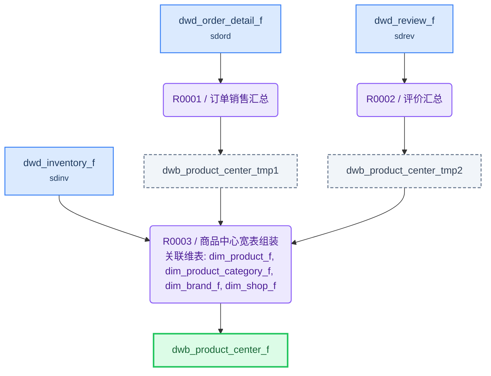

# ETL 技术规格(TS)

> 目标表: `slprd.dwb_product_center_f`(商品中心宽表) - 生成 2026-08-04T23:10:10

---

## 1. 概述

| 项目 | 内容 |
|------|------|
| **F 表** | `slprd.dwb_product_center_f`（商品中心宽表） |
| **I 视图** | `slprd.dwb_product_center_i`（F表镜像，对外查询） |
| **业务主键** | product_id |
| **写入策略** | 全量（可随时重刷） |
| **字段统计** | 39 |
| **规则数** | 3 |

**来源表**:

| # | 表名 | 中文名 | 别名 |
|---|------|--------|------|
| 1 | dim.dim_product_f | 商品维度表 | dpf |
| 2 | dim.dim_product_category_f | 商品分类维度表 | dpc |
| 3 | dim.dim_brand_f | 品牌维度表 | dbf |
| 4 | dim.dim_shop_f | 店铺维度表 | dsf |
| 5 | sdinv.dwd_inventory_f | 库存事实表 | dif |
| 6 | sdord.dwd_order_detail_f | 订单商品明细事实表 | dod |
| 7 | sdrev.dwd_review_f | 评价事实表 | drf |

---

## 2. 表模型设计

| 表名 | 类型 | 分布 | 分区 | 字段数 | 说明 |
|------|------|------|------|--------|------|
| `dwb_product_center_f` | 目标F表 | HASH(product_id) | — | 32 | 商品中心宽表 |
| `dwb_product_center_tmp1` | 中间表 | HASH(product_id) | — | 4 | 将订单明细按商品粒度聚合 |
| `dwb_product_center_tmp2` | 中间表 | HASH(product_id) | — | 3 | 将评价明细按商品粒度聚合 |
| `dwb_product_center_i` | 直封视图 | — | — | 同F表 | F表镜像，对外查询 |

---

## 3. 复杂度分析与分段决策

| 因素 | 值 | 阈值 |
|------|-----|------|
| JOIN 表数量 | 7 | >12 触发分段 |
| 粒度变化 | 有 | 有即评估分段 |
| 多步骤加工字段 | 7 | ≥5 触发分段 |
| 聚合后关联 | 否 | 是即评估分段 |

> 粒度变化说明: 订单明细(多条/商品)和评价(多条/商品)需聚合到商品粒度；主规则本身粒度不变

**分段结论**: **分段**

> 多步骤加工字段 7 个（≥5 阈值），且来自 2 个不同事实表需独立 GROUP BY 聚合。拆 2 张中间表（订单汇总+评价汇总）并行执行，降低主规则 SQL 复杂度，支持中间结果独立校验

---

## 4. 规则详情

### R0001 - 订单销售汇总

| 项目 | 内容 |
|------|------|
| 执行序 | 1 |
| 产出表 | `dwb_product_center_tmp1` |
| 写入方式 | truncate_table |
| 设计意图 | 将订单明细按商品粒度聚合，收口为每商品一行的销售指标，解耦主规则的聚合复杂度 |
| 字段数 | 4 |

**字段逻辑**:

- `total_sales_qty`: 从订单明细表按 product_id 汇总 SUM(qty)，统计累计总销量
- `total_sales_amount`: 从订单明细表按 product_id 汇总 SUM(real_price * qty)，统计累计销售额
- `buyer_cnt`: 从订单明细表按 product_id 统计 COUNT(DISTINCT user_id)，去重计数购买人数
- `sales_qty_30d`: 从订单明细表按 product_id 汇总近30天 SUM(qty)，需用订单日期过滤近30天范围

---

### R0002 - 评价汇总

| 项目 | 内容 |
|------|------|
| 执行序 | 1 |
| 产出表 | `dwb_product_center_tmp2` |
| 写入方式 | truncate_table |
| 设计意图 | 将评价明细按商品粒度聚合，收口为每商品一行的评价指标，与订单汇总并行执行 |
| 字段数 | 3 |

**字段逻辑**:

- `review_cnt`: 从评价表按 product_id 统计 COUNT(*)，统计评价总数
- `avg_rating`: 从评价表按 product_id 计算 AVG(rating)，保留1位小数
- `good_review_rate`: 从评价表按 product_id 统计好评数(rating>=4)占评价总数的百分比，结果保留2位小数

---

### R0003 - 商品中心宽表组装

| 项目 | 内容 |
|------|------|
| 执行序 | 2 |
| 产出表 | `dwb_product_center_f` |
| 写入方式 | truncate_table |
| 设计意图 | 以商品维度表为主表，LEFT JOIN 分类/品牌/店铺/库存 + 中间表汇总指标，组装商品中心宽表 |
| 字段数 | 32 |

**字段逻辑**:

- `product_status_name`: 商品状态翻译：ON_SHELF→上架，OFF_SHELF→下架，SOLD_OUT→售罄，其余→其他
- `discount_rate`: (市场价 - 销售价) / 市场价 * 100，计算折扣率百分比
- `gross_profit`: 销售价 - 成本价，计算单品毛利
- `gross_profit_rate`: (销售价 - 成本价) / 销售价 * 100，计算毛利率百分比
- `available_qty`: 库存数量 - 锁定数量，计算可售数量
- `stock_status`: 根据可售数量判断库存状态：可售数量<=0 为缺货，<=库存预警值 为低库存，否则为正常

---

## 5. 数据流向

---

## 6. 调度配置

### F 表调度

| 配置项 | 值 |
|--------|-----|
| 调度任务 | TASK_DWB_PRODUCT_CENTER_F |
| 调度周期 | 0 30 3 * * ? |

**LTS 参数**:

| LTS 变量 | 赋值给 ETL 参数 | 说明 |
|----------|----------------|------|
| V_CYCLE_ID | P_CYCLE_ID | 批次号 |
| V_GROUP_CODE | — | 规则组编码 |

### I 视图调度

| 配置项 | 值 |
|--------|-----|
| 调度任务 | TASK_DWB_PRODUCT_CENTER_I |
| 调度周期 | 0 35 3 * * ? |

**上游依赖**:

| 源表 | 调度任务 |
|------|---------|
| dwb_product_center_f | TASK_DWB_PRODUCT_CENTER_F |

---

## 7. 数据质量检查(DQ)

*(本表无 DQ 要求)*
