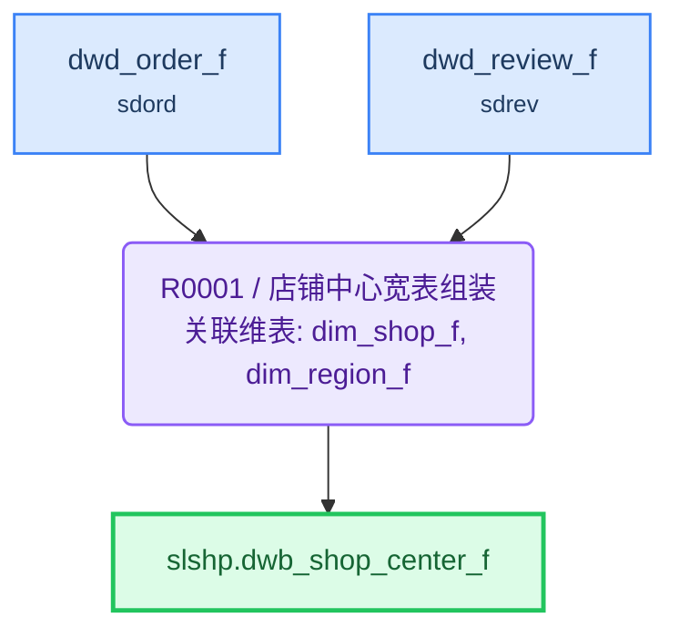

# ETL 技术规格(TS)

> 目标表: `slshp.dwb_shop_center_f`(店铺中心宽表) - 生成 2026-08-04T22:05:32

---

## 1. 概述

| 项目 | 内容 |
|------|------|
| **F 表** | `slshp.dwb_shop_center_f`（店铺中心宽表） |
| **I 视图** | `slshp.dwb_shop_center_i`（F表镜像，对外查询） |
| **业务主键** | shop_id |
| **写入策略** | 全量（可随时重刷） |
| **字段统计** | 20 |
| **规则数** | 1 |

**来源表**:

| # | 表名 | 中文名 | 别名 |
|---|------|--------|------|
| 1 | dim.dim_shop_f | 店铺维度表 | dsf |
| 2 | dim.dim_region_f | 地区维度表 | drf |
| 3 | sdord.dwd_order_f | 订单明细事实表 | dof |
| 4 | sdrev.dwd_review_f | 评价事实表 | drf3 |

---

## 2. 表模型设计

| 表名 | 类型 | 分布 | 分区 | 字段数 | 说明 |
|------|------|------|------|--------|------|
| `dwb_shop_center_f` | 目标F表 | HASH(shop_id) | — | 20 | 店铺中心宽表 |
| `dwb_shop_center_i` | 直封视图 | — | — | 同F表 | F表镜像，对外查询 |

---

## 3. 复杂度分析与分段决策

| 因素 | 值 | 阈值 |
|------|-----|------|
| JOIN 表数量 | 4 | >12 触发分段 |
| 粒度变化 | 有 | 有即评估分段 |
| 多步骤加工字段 | 4 | ≥5 触发分段 |
| 聚合后关联 | 是 | 是即评估分段 |

> 粒度变化说明: 订单事实表(订单粒度)和评价事实表(评价粒度)需聚合到店铺粒度后关联

**分段结论**: **不分段**

> JOIN表数(4)远低于阈值(12)，多步骤字段(4)低于阈值(5)； 订单/评价聚合逻辑简单(COUNT/SUM)，通过 CTE 内联处理即可， 单条 INSERT 可清晰表达，无需物理中间表。

---

## 4. 规则详情

### R0001 - 店铺中心宽表组装

| 项目 | 内容 |
|------|------|
| 执行序 | 1 |
| 产出表 | `slshp.dwb_shop_center_f` |
| 写入方式 | truncate_table |
| 设计意图 | 以店铺维度表为主表，LEFT JOIN 地区维度表获取省份名称； 通过 CTE 预聚合订单/评价事实表到店铺粒度，避免多表直接 JOIN 的 fan-out； 标量加工字段（类型/状态映射、营业天数）在主表行内计算。
 |
| 字段数 | 20 |

**字段逻辑**:

- `shop_type_name`: 店铺类型中文映射：FLAGSHIP→旗舰店，SPECIALTY→专卖店，FRANCHISE→专营店，其余→其他
- `shop_status_name`: 店铺状态中文映射：OPEN→营业中，CLOSED→已关闭，FROZEN→冻结，其余→其他
- `open_days`: 营业天数 = 当前日期减开店时间的天数差（DATEDIFF）
- `total_order_cnt`: 累计订单数：CTE order_stat 预聚合 dwd_order_f 按 shop_id 统计 COUNT(*)
- `total_sales_amount`: 累计销售额：CTE order_stat 预聚合 dwd_order_f 按 shop_id 汇总 SUM(pay_amount)
- `total_buyer_cnt`: 累计购买人数：CTE order_stat 预聚合 dwd_order_f 按 shop_id 统计 COUNT(DISTINCT user_id)
- `review_cnt`: 评价数：CTE review_stat 预聚合 dwd_review_f 按 shop_id 统计 COUNT(*)

---

## 5. 数据流向

---

## 6. 调度配置

### F 表调度

| 配置项 | 值 |
|--------|-----|
| 调度任务 | slshp_dwb_shop_center_f |
| 调度周期 | 0 0 3 * * ? |

**LTS 参数**:

| LTS 变量 | 赋值给 ETL 参数 | 说明 |
|----------|----------------|------|
| V_CYCLE_ID | P_CYCLE_ID | 批次号 |
| V_GROUP_CODE | — | 规则组编码 |

---

## 7. 数据质量检查(DQ)

*(本表无 DQ 要求)*
