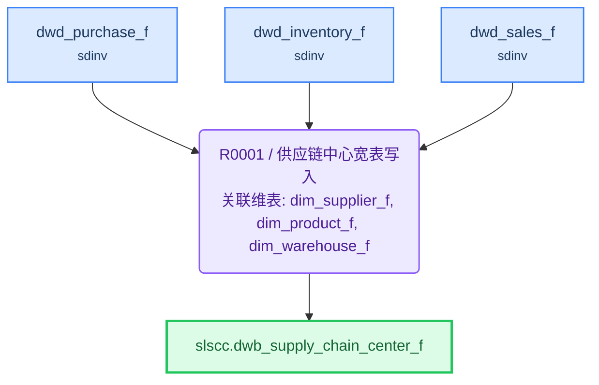

# ETL 技术规格(TS)

> 目标表: `slscc.dwb_supply_chain_center_f`(供应链中心宽表) - 生成 2026-08-04T22:10:49

---

## 1. 概述

| 项目 | 内容 |
|------|------|
| **F 表** | `slscc.dwb_supply_chain_center_f`（供应链中心宽表） |
| **I 视图** | `slscc.dwb_supply_chain_center_i`（F表镜像，对外查询） |
| **业务主键** | purchase_id |
| **写入策略** | 全量（可随时重刷） |
| **字段统计** | 23 |
| **规则数** | 1 |

**来源表**:

| # | 表名 | 中文名 | 别名 |
|---|------|--------|------|
| 1 | sdinv.dwd_purchase_f | 采购事实表 | dpf |
| 2 | dim.dim_supplier_f | 供应商维度表 | dsf |
| 3 | dim.dim_product_f | 商品维度表 | dpf2 |
| 4 | dim.dim_warehouse_f | 仓库维度表 | dwf |
| 5 | sdinv.dwd_inventory_f | 库存事实表 | dif |
| 6 | sdinv.dwd_sales_f | 销售事实表 | dsales |

---

## 2. 表模型设计

| 表名 | 类型 | 分布 | 分区 | 字段数 | 说明 |
|------|------|------|------|--------|------|
| `dwb_supply_chain_center_f` | 目标F表 | HASH(purchase_id) | — | 23 | 供应链中心宽表 |
| `dwb_supply_chain_center_i` | 直封视图 | — | — | 同F表 | F表镜像，对外查询 |

---

## 3. 复杂度分析与分段决策

| 因素 | 值 | 阈值 |
|------|-----|------|
| JOIN 表数量 | 6 | >12 触发分段 |
| 粒度变化 | 有 | 有即评估分段 |
| 多步骤加工字段 | 1 | ≥5 触发分段 |
| 聚合后关联 | 否 | 是即评估分段 |

> 粒度变化说明: 销售事实表(dwd_sales_f)从销售明细粒度聚合到商品粒度(sales_agg CTE)后关联主表

**分段结论**: **不分段**

> JOIN≤12（6张）、多步骤加工字段<5（1个：stock_days）、无复杂关联链；dsales聚合满足CTE内联条件（仅本规则内用一次、无需独立校验），不建物理中间表

---

## 4. 规则详情

### R0001 - 供应链中心宽表写入

| 项目 | 内容 |
|------|------|
| 执行序 | 1 |
| 产出表 | `slscc.dwb_supply_chain_center_f` |
| 写入方式 | truncate_table |
| 设计意图 | 以采购事实表(dp)为主表锚定粒度，LEFT JOIN 供应商/商品/仓库维度表补充属性，LEFT JOIN 库存事实表取当前库存与锁定库存，通过CTE预聚合销售表按product_id统计近30天销量后关联，计算库存周转天数，写入供应链中心宽表 |
| 字段数 | 23 |

**关联风险**:

- `dwd_sales_f`: CTE预聚合收敛

**字段逻辑**:

- `purchase_status_name`: 采购状态码转中文映射：DRAFT→草稿，SUBMITTED→已提交，APPROVED→已审批，RECEIVED→已入库，CLOSED→已关闭，其余→其他
- `supplier_level_name`: 供应商等级码转中文映射：A→A级供应商，B→B级供应商，C→C级供应商，其余→其他
- `purchase_amount`: 采购金额 = 采购数量(purchase_qty) × 采购单价(purchase_price)
- `warehouse_type_name`: 仓库类型码转中文映射：SELF→自营仓，THIRD_PARTY→第三方仓，其余→其他
- `stock_days`: 库存周转天数 = (当前库存 - 锁定库存) / 近30天日均销量。近30天销量通过CTE(sales_agg)对销售表按product_id聚合SUM得到，除零保护用NULLIF(sales_qty_30d, 0)，结果为NULL或零时库存周转天数取NULL

---

## 5. 数据流向

---

## 6. 调度配置

### F 表调度

| 配置项 | 值 |
|--------|-----|
| 调度任务 | task_dwb_supply_chain_center_f |
| 调度周期 | 0 30 3 * * ? |

**LTS 参数**:

| LTS 变量 | 赋值给 ETL 参数 | 说明 |
|----------|----------------|------|
| V_CYCLE_ID | P_CYCLE_ID | 批次号 |
| V_GROUP_CODE | — | 规则组编码 |

### I 视图调度

| 配置项 | 值 |
|--------|-----|
| 调度任务 | task_dwb_supply_chain_center_i |
| 调度周期 | 0 35 3 * * ? |

**上游依赖**:

| 源表 | 调度任务 |
|------|---------|
| dwb_supply_chain_center_f | task_dwb_supply_chain_center_f |

---

## 7. 数据质量检查(DQ)

*(本表无 DQ 要求)*
