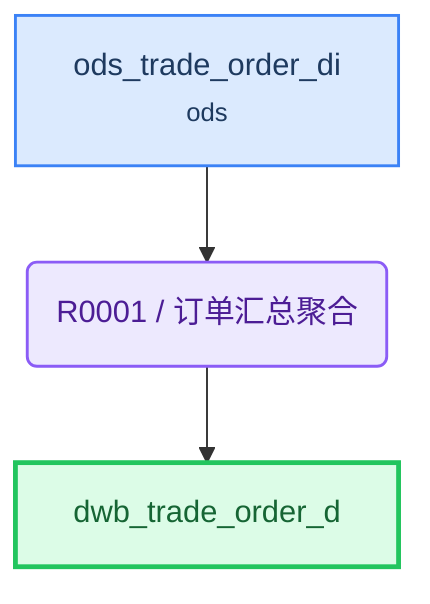

# ETL 技术规格(TS)

> 目标表: `dws.dwb_trade_order_d`(订单汇总表) - 生成 2026-08-05T00:12:42

---

## 1. 概述

| 项目 | 内容 |
|------|------|
| **F 表** | `dws.dwb_trade_order_d`（订单汇总表） |
| **I 视图** | `dws.dwb_trade_order_d_i`（F表镜像，对外查询） |
| **业务主键** | order_id |
| **写入策略** | 全量（可随时重刷） |
| **字段统计** | 7 |
| **规则数** | 1 |

**来源表**:

| # | 表名 | 中文名 | 别名 |
|---|------|--------|------|
| 1 | ods.ods_trade_order_di | 订单明细接入表 | a |

---

## 2. 表模型设计

| 表名 | 类型 | 分布 | 分区 | 字段数 | 说明 |
|------|------|------|------|--------|------|
| `dwb_trade_order_d` | 目标F表 | HASH(order_id) | — | 7 | 订单汇总表 |
| `dwb_trade_order_d_i` | 直封视图 | — | — | 同F表 | F表镜像，对外查询 |

---

## 3. 复杂度分析与分段决策

| 因素 | 值 | 阈值 |
|------|-----|------|
| JOIN 表数量 | 0 | >12 触发分段 |
| 粒度变化 | 有 | 有即评估分段 |
| 多步骤加工字段 | 1 | ≥5 触发分段 |
| 聚合后关联 | 否 | 是即评估分段 |

> 粒度变化说明: 源为订单明细行（一单多行），目标为订单级（一单一行），按 order_id+cust_id 聚合收敛

**分段结论**: **不分段**

> 单源表、零 JOIN、仅 1 个聚合字段，复杂度低，单条 INSERT 即可完成

---

## 4. 规则详情

### R0001 - 订单汇总聚合

| 项目 | 内容 |
|------|------|
| 执行序 | 1 |
| 产出表 | `dwb_trade_order_d` |
| 写入方式 | truncate_table |
| 设计意图 | 从订单明细接入表按 order_id+cust_id 聚合到订单粒度，汇总金额，直取订单与客户标识，补审计字段 |
| 字段数 | 7 |

**字段逻辑**:

- `total_amount`: 对同一 order_id + cust_id 的 amount 求和汇总（SUM(amount) GROUP BY order_id, cust_id）

---

## 5. 数据流向

---

## 6. 调度配置

### F 表调度

| 配置项 | 值 |
|--------|-----|
| 调度任务 | dwb_trade_order_d |
| 调度周期 | 0 30 3 * * ? |

**LTS 参数**:

| LTS 变量 | 赋值给 ETL 参数 | 说明 |
|----------|----------------|------|
| V_CYCLE_ID | P_CYCLE_ID | 批次号 |
| V_GROUP_CODE | — | 规则组编码 |

### I 视图调度

| 配置项 | 值 |
|--------|-----|
| 调度任务 | dwb_trade_order_d_i |
| 调度周期 | 0 35 3 * * ? |

**上游依赖**:

| 源表 | 调度任务 |
|------|---------|
| dwb_trade_order_d | dwb_trade_order_d |

---

## 7. 数据质量检查(DQ)

*(本表无 DQ 要求)*
