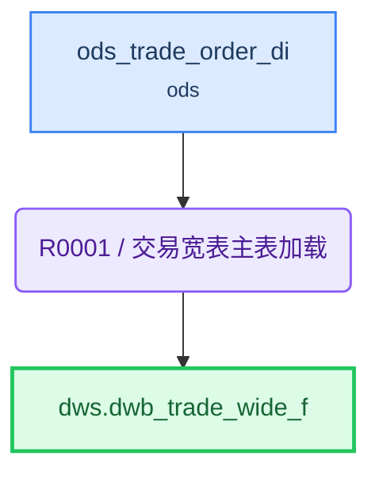

# ETL 技术规格(TS)

> 目标表: `dws.dwb_trade_wide_f`(交易宽表) - 生成 2026-08-04T22:00:07

---

## 1. 概述

| 项目 | 内容 |
|------|------|
| **F 表** | `dws.dwb_trade_wide_f`（交易宽表） |
| **I 视图** | `dws.dwb_trade_wide_i`（F表镜像，对外查询） |
| **业务主键** | order_id |
| **写入策略** | 全量（可随时重刷） |
| **字段统计** | 8 |
| **规则数** | 1 |

**来源表**:

| # | 表名 | 中文名 | 别名 |
|---|------|--------|------|
| 1 | ods.ods_trade_order_di | 订单明细 | o |

---

## 2. 表模型设计

| 表名 | 类型 | 分布 | 分区 | 字段数 | 说明 |
|------|------|------|------|--------|------|
| `dwb_trade_wide_f` | 目标F表 | HASH(order_id) | — | 8 | 交易宽表 |
| `dwb_trade_wide_i` | 直封视图 | — | — | 同F表 | F表镜像，对外查询 |

---

## 3. 复杂度分析与分段决策

| 因素 | 值 | 阈值 |
|------|-----|------|
| JOIN 表数量 | 0 | >12 触发分段 |
| 粒度变化 | 无 | 有即评估分段 |
| 多步骤加工字段 | 0 | ≥5 触发分段 |
| 聚合后关联 | 否 | 是即评估分段 |

**分段结论**: **不分段**

> 单源主表无关联（join_count=0），无粒度变化，所有字段为直接复制或审计赋值，单条 INSERT 即可完成，无需中间表/分段。

---

## 4. 规则详情

### R0001 - 交易宽表主表加载

| 项目 | 内容 |
|------|------|
| 执行序 | 1 |
| 产出表 | `dws.dwb_trade_wide_f` |
| 写入方式 | truncate_table |
| 设计意图 | 单源主表直加载，无关联无加工，全量覆盖写入目标F表。 |
| 字段数 | 8 |

---

## 5. 数据流向

---

## 6. 调度配置

### F 表调度

| 配置项 | 值 |
|--------|-----|
| 调度任务 | DWS_DWB_TRADE_WIDE_F |
| 调度周期 | 0 0 3 * * ? |

**LTS 参数**:

| LTS 变量 | 赋值给 ETL 参数 | 说明 |
|----------|----------------|------|
| V_CYCLE_ID | P_CYCLE_ID | 批次号 |
| V_GROUP_CODE | — | 规则组编码 |

---

## 7. 数据质量检查(DQ)

*(本表无 DQ 要求)*
