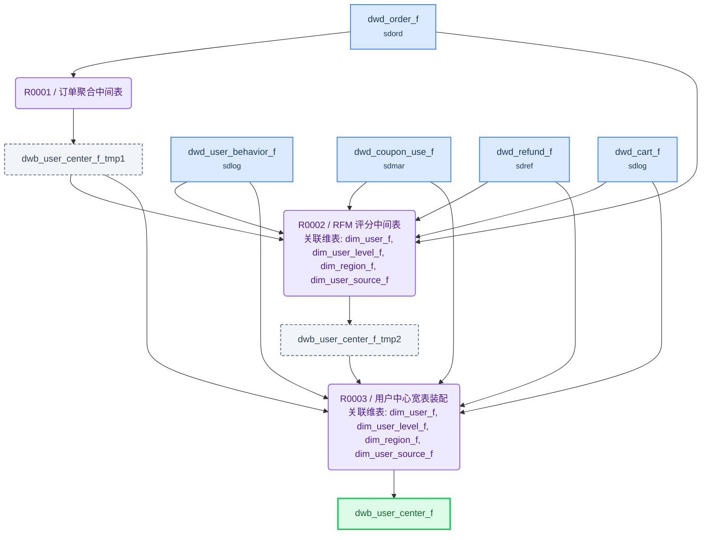

# ETL 技术规格(TS)

> 目标表: `slusr.dwb_user_center_f`(用户中心宽表) - 生成 2026-08-05T00:01:22

---

## 1. 概述

| 项目 | 内容 |
|------|------|
| **F 表** | `slusr.dwb_user_center_f`（用户中心宽表） |
| **I 视图** | `slusr.dwb_user_center_i`（F表镜像，对外查询） |
| **业务主键** | user_id |
| **写入策略** | 全量（可随时重刷） |
| **字段统计** | 46 |
| **规则数** | 3 |

**来源表**:

| # | 表名 | 中文名 | 别名 |
|---|------|--------|------|
| 1 | dim.dim_user_f | 用户维度表 | duf |
| 2 | dim.dim_user_level_f | 用户等级维度表 | dul |
| 3 | dim.dim_region_f | 地区维度表 | drf |
| 4 | dim.dim_user_source_f | 用户来源维度表 | dus |
| 5 | sdord.dwd_order_f | 订单明细事实表 | dof |
| 6 | sdlog.dwd_user_behavior_f | 用户行为事实表 | dub |
| 7 | sdmar.dwd_coupon_use_f | 优惠券使用事实表 | dcu |
| 8 | sdref.dwd_refund_f | 退款事实表 | drf7 |
| 9 | sdlog.dwd_cart_f | 购物车事实表 | dcf |

---

## 2. 表模型设计

| 表名 | 类型 | 分布 | 分区 | 字段数 | 说明 |
|------|------|------|------|--------|------|
| `dwb_user_center_f` | 目标F表 | HASH(user_id) | — | 37 | 用户中心宽表 |
| `dwb_user_center_f_tmp1` | 中间表 | HASH(user_id) | — | 5 | 将订单明细事实表聚合到用户粒度 |
| `dwb_user_center_f_tmp2` | 中间表 | HASH(user_id) | — | 4 | 基于订单聚合指标用 NTILE(5) 窗口函数跨全量用户打分 |
| `dwb_user_center_i` | 直封视图 | — | — | 同F表 | F表镜像，对外查询 |

---

## 3. 复杂度分析与分段决策

| 因素 | 值 | 阈值 |
|------|-----|------|
| JOIN 表数量 | 10 | >12 触发分段 |
| 粒度变化 | 有 | 有即评估分段 |
| 多步骤加工字段 | 11 | ≥5 触发分段 |
| 聚合后关联 | 是 | 是即评估分段 |

> 粒度变化说明: 5 张事实表（订单/行为/优惠券/退款/购物车）从明细粒度聚合到用户粒度；RFM 评分需跨全量用户 NTILE(5) 窗口排序

**分段结论**: **分段**

> 命中多个分段阈值：多步骤加工字段≥5（RFM 三维评分+分层、转化率、退款率、客单价等 11 个）、有粒度变化（5 表聚合）、聚合后关联。订单聚合被 RFM 评分与最终装配复用→建物理中间表 tmp1；RFM 窗口评分独立加工且为关键属性→建物理中间表 tmp2；行为/优惠/退款/购物车聚合仅用一次→CTE 内联

---

## 4. 规则详情

### R0001 - 订单聚合中间表

| 项目 | 内容 |
|------|------|
| 场景 | 订单统计 |
| 执行序 | 1 |
| 产出表 | `dwb_user_center_f_tmp1` |
| 写入方式 | truncate_table |
| 设计意图 | 将订单明细事实表聚合到用户粒度，产出历史订单统计指标，供 RFM 评分与最终宽表复用 |
| 字段数 | 5 |

**关联风险**:

- `dwd_order_f`: GROUP BY user_id 收敛聚合（一个用户多条订单→一行统计）

**字段逻辑**:

- `total_order_cnt`: 从 dwd_order_f 按 user_id 分组，COUNT(*) 统计历史有效订单数（过滤 order_status NOT IN ('CANCELLED','DELETED')）
- `total_pay_amount`: 从 dwd_order_f 按 user_id 分组，SUM(pay_amount) 统计历史有效订单消费金额（过滤 order_status NOT IN ('CANCELLED','DELETED')）
- `avg_order_amount`: 平均客单价 = 总消费金额 / 历史订单数，分母为 0 时返回 NULL（NULLIF 防除零）
- `last_order_time`: 从 dwd_order_f 按 user_id 分组，MAX(create_time) 取最近一次下单时间
- `first_order_time`: 从 dwd_order_f 按 user_id 分组，MIN(create_time) 取首次下单时间

---

### R0002 - RFM 评分中间表

| 项目 | 内容 |
|------|------|
| 场景 | 用户价值分层 |
| 执行序 | 2 |
| 产出表 | `dwb_user_center_f_tmp2` |
| 写入方式 | truncate_table |
| 设计意图 | 基于订单聚合指标用 NTILE(5) 窗口函数跨全量用户打分，产出 RFM 三维分数与价值分层 |
| 字段数 | 4 |

**字段逻辑**:

- `rfm_r_score`: 第一步：DATEDIFF(CURDATE(), last_order_time) 计算最近下单距今天数（R 值，越小越优）；第二步：NTILE(5) 窗口函数按 R 值升序分 5 组，天数越小分数越高（5→1）
- `rfm_f_score`: 第一步：取 total_order_cnt 作为消费频次（F 值）；第二步：NTILE(5) 窗口函数按 F 值降序分 5 组，订单越多分数越高
- `rfm_m_score`: 第一步：取 total_pay_amount 作为消费金额（M 值）；第二步：NTILE(5) 窗口函数按 M 值降序分 5 组，金额越高分数越高
- `rfm_segment`: 组合 RFM 三维分数划分价值分层：高价值（R/F/M 均≥4）、中价值（任两维≥4）、低价值（任一维≥3）、流失（R≤2 且 F≤2）

---

### R0003 - 用户中心宽表装配

| 项目 | 内容 |
|------|------|
| 场景 | 用户基础属性 |
| 执行序 | 3 |
| 产出表 | `dwb_user_center_f` |
| 写入方式 | truncate_table |
| 设计意图 | 以 dim_user_f 为主表左联维度表与中间表，CTE 聚合行为/优惠/退款/购物车事实，计算派生转化率与标签，产出最终宽表 |
| 字段数 | 37 |

**字段逻辑**:

- `user_phone_masked`: 手机号脱敏：CONCAT(LEFT(user_phone,3),'****',RIGHT(user_phone,4))，保留前 3 位与后 4 位
- `gender_name`: 性别代码转中文：M→男，F→女，其他→未知
- `age`: 年龄 = YEAR(CURDATE()) - YEAR(birthday)
- `register_days`: 注册天数 = DATEDIFF(CURDATE(), register_time)
- `user_status_name`: 用户状态代码转中文：ACTIVE→正常，INACTIVE→未激活，FROZEN→冻结，其他→其他
- `city_name`: 通过 city_code 二次关联 dim_region_f 获取城市名称（dim_region_f 关联两次：一次取省份 province_code，一次取城市 city_code）
- `total_pv_cnt`: CTE 从 dwd_user_behavior_f 按 user_id 聚合，SUM(pv_cnt) 统计历史浏览次数
- `total_collect_cnt`: CTE 从 dwd_user_behavior_f 按 user_id 聚合，SUM(collect_cnt) 统计历史收藏次数
- `total_cart_cnt`: CTE 从 dwd_user_behavior_f 按 user_id 聚合，SUM(cart_cnt) 统计历史加购次数
- `pv_to_order_rate`: 浏览-下单转化率(%) = 历史订单数 / 浏览次数 × 100，分母为 0 时返回 NULL（NULLIF 防除零）
- `pv_to_cart_rate`: 浏览-加购转化率(%) = 加购次数 / 浏览次数 × 100，分母为 0 时返回 NULL（NULLIF 防除零）
- `coupon_used_cnt`: CTE 从 dwd_coupon_use_f 按 user_id 聚合，COUNT(*) 统计优惠券使用次数
- `coupon_total_amount`: CTE 从 dwd_coupon_use_f 按 user_id 聚合，SUM(coupon_amount) 统计优惠券使用总金额
- `refund_cnt`: CTE 从 dwd_refund_f 按 user_id 聚合，COUNT(*) 统计退款次数
- `refund_rate`: 退款率(%) = 退款次数 / 历史订单数 × 100，分母为 0 时返回 NULL（NULLIF 防除零）
- `cart_product_cnt`: CTE 从 dwd_cart_f（过滤 del_flag='N' 有效记录）按 user_id 聚合，COUNT(*) 统计购物车商品数
- `cart_total_amount`: CTE 从 dwd_cart_f（过滤 del_flag='N' 有效记录）按 user_id 聚合，SUM(qty*price) 统计购物车总金额
- `order_freq_label`: 下单频率标签：历史订单数≥10→高频用户，≥3→中频用户，≥1→低频用户，0→未购买
- `consume_level_label`: 消费能力标签：历史消费金额≥10000→高消费，≥1000→中消费，≥100→低消费，其他→无消费

---

## 5. 数据流向

---

## 6. 调度配置

### F 表调度

| 配置项 | 值 |
|--------|-----|
| 调度任务 | dwb_user_center_f |
| 调度周期 | 0 30 3 * * ? |

**LTS 参数**:

| LTS 变量 | 赋值给 ETL 参数 | 说明 |
|----------|----------------|------|
| V_CYCLE_ID | P_CYCLE_ID | 批次号 |
| V_GROUP_CODE | — | 规则组编码 |

### I 视图调度

| 配置项 | 值 |
|--------|-----|
| 调度任务 | dwb_user_center_i |
| 调度周期 | 0 35 3 * * ? |

**上游依赖**:

| 源表 | 调度任务 |
|------|---------|
| dwb_user_center_f | dwb_user_center_f |

---

## 7. 数据质量检查(DQ)

*(本表无 DQ 要求)*
