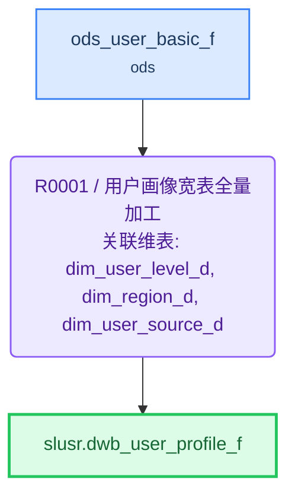

# ETL 技术规格(TS)

> 目标表: `slusr.dwb_user_profile_f`(用户画像宽表) - 生成 2026-08-04T23:27:14

---

## 1. 概述

| 项目 | 内容 |
|------|------|
| **F 表** | `slusr.dwb_user_profile_f`（用户画像宽表） |
| **I 视图** | `slusr.dwb_user_profile_i`（F表镜像，对外查询） |
| **业务主键** | user_id |
| **写入策略** | 全量（可随时重刷） |
| **字段统计** | 187 |
| **规则数** | 1 |

**来源表**:

| # | 表名 | 中文名 | 别名 |
|---|------|--------|------|
| 1 | ods.ods_user_basic_f | 用户基础信息表 | oub |
| 2 | dim.dim_user_level_d | 用户等级维度表 | dul |
| 3 | dim.dim_region_d | 地区维度表 | drd |
| 4 | dim.dim_user_source_d | 用户来源维度表 | dus |

---

## 2. 表模型设计

| 表名 | 类型 | 分布 | 分区 | 字段数 | 说明 |
|------|------|------|------|--------|------|
| `dwb_user_profile_f` | 目标F表 | HASH(user_id) | — | 187 | 用户画像宽表 |
| `dwb_user_profile_i` | 直封视图 | — | — | 同F表 | F表镜像，对外查询 |

---

## 3. 复杂度分析与分段决策

| 因素 | 值 | 阈值 |
|------|-----|------|
| JOIN 表数量 | 3 | >12 触发分段 |
| 粒度变化 | 无 | 有即评估分段 |
| 多步骤加工字段 | 11 | ≥5 触发分段 |
| 聚合后关联 | 否 | 是即评估分段 |

> 粒度变化说明: 输入用户行，输出用户行，粒度无变化

**分段结论**: **不分段**

> JOIN 表数量 3（远低于阈值 12），无粒度变化，加工字段均为单字段变换无聚合后关联，复杂度低，单条 INSERT 即可完成全量重写

---

## 4. 规则详情

### R0001 - 用户画像宽表全量加工

| 项目 | 内容 |
|------|------|
| 执行序 | 1 |
| 产出表 | `slusr.dwb_user_profile_f` |
| 写入方式 | truncate_table |
| 设计意图 | 用户画像宽表全量重写：以 oub 用户基础表为主表，LEFT JOIN 等级/地区/来源三张维表补齐画像属性，并对敏感字段脱敏、枚举字段转中文、派生时间维度字段。无粒度变化、无聚合，单条 INSERT 即可完成。 |
| 字段数 | 187 |

**字段逻辑**:

- `user_phone_processed`: 手机号脱敏：保留前3位和后4位，中间用4个星号屏蔽
- `gender_processed`: 性别代码转中文：M转男、F转女，其余值转未知
- `age_processed`: 由出生日期计算年龄：当前年份减去出生年份
- `id_card_masked_processed`: 身份证号脱敏：保留前6位和后4位，中间用8个星号屏蔽
- `user_status_name_processed`: 用户状态代码转中文名称：ACTIVE转正常、INACTIVE转未激活、BANNED转封禁，其余值转未知
- `register_date_processed`: 从注册时间戳提取日期部分
- `register_hour_processed`: 从注册时间戳提取小时（24小时制）
- `register_weekday_processed`: 从注册时间戳提取星期几
- `last_login_date_processed`: 从最后登录时间戳提取日期部分
- `is_vip_processed`: 判断是否VIP：VIP到期时间大于当前时间则为1，否则为0
- `progress_percentage`: 升级进度百分比：当前等级积分除以升级所需积分再乘以100

---

## 5. 数据流向

---

## 6. 调度配置

### F 表调度

| 配置项 | 值 |
|--------|-----|
| 调度任务 | dwb_user_profile_f |
| 调度周期 | 0 30 3 * * ? |

**LTS 参数**:

| LTS 变量 | 赋值给 ETL 参数 | 说明 |
|----------|----------------|------|
| V_CYCLE_ID | P_CYCLE_ID | 批次号 |

### I 视图调度

| 配置项 | 值 |
|--------|-----|
| 调度任务 | dwb_user_profile_i |
| 调度周期 | 0 35 3 * * ? |

**上游依赖**:

| 源表 | 调度任务 |
|------|---------|
| dwb_user_profile_f | dwb_user_profile_f |

---

## 7. 数据质量检查(DQ)

*(本表无 DQ 要求)*
