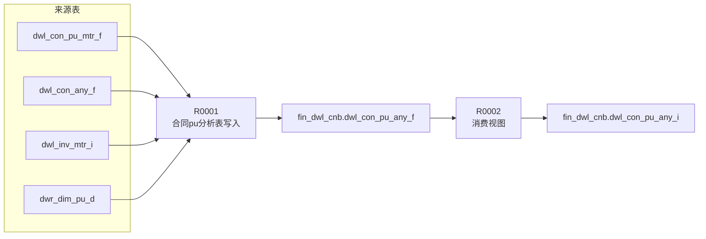

# ETL 技术规格（TS）

> 本制品包由 `ts.json`（机读，权威源）+ `ts.md`（人读，投影）组成。
> 完整字段映射见 `ts.json`，本文档为概要，供闸口①确认方向。

---

## 1. 概述

| 项目 | 内容 |
|------|------|
| **F 表** | `fin_dwl_cnb.dwl_con_pu_any_f`（合同pu分析表，物理表） |
| **I 视图** | `fin_dwl_cnb.dwl_con_pu_any_i`（F表镜像，对外消费接口） |
| **目标粒度** | 每个合同+pu一行（contract_id, pu_id） |
| **写入策略** | 全量覆盖 |
| **分布键** | contract_id, pu_id |
| **字段统计** | 业务 12 + 审计 4 = 总计 16 |
| **场景数** | 1（默认场景） |
| **规则数** | 2（R0001 写入 + R0002 视图） |

**来源表**：

| # | 表名 | 中文名 | 别名 | 层 |
|---|------|--------|------|-----|
| 1 | fin_dwl_cnb.dwl_con_pu_mtr_f | 合同pu指标表 | t | DWL |
| 2 | fin_dwl_cnb.dwl_con_any_f | 合同分析表 | f | DWL |
| 3 | fin_dwl_cnb.dwl_inv_mtr_i | 发票指标表 | inv_mtr | DWL |
| 4 | dwrdim_dw1.dwr_dim_pu_d | pu维表 | pu | DIM |

---

## 2. 表模型设计

### 2.1 目标表

| 项目 | 值 |
|------|-----|
| schema | fin_dwl_cnb |
| F 表 | dwl_con_pu_any_f（存数据） |
| I 视图 | dwl_con_pu_any_i（F表镜像，对外查询） |
| 表类型 | 事实表（分析宽表） |
| 分布键 | contract_id, pu_id |
| 分区 | 无 |

> I 视图 = `CREATE OR REPLACE VIEW ..._i AS SELECT * FROM ..._f`，固定模式，字段不变则F表逻辑变化不影响I。
> F 表字段结构见 RS（不在 TS 重复定义）。

### 2.2 中间表

本表无物理中间表。字段清单待规则详情（§4）完成后回填。

| 中间逻辑 | 类型 | 名称 | 粒度 | 用途 |
|----------|------|------|------|------|
| 发票收敛聚合 | CTE（内联于R0001） | inv_agg | (contract_id, pu_id) | 发票指标表按合同+pu收敛求和（排除非洲发票），避免JOIN发散 |

> 是否建物理中间表的评估见 §3。

---

## 3. 复杂度分析与分段决策

### 3.1 复杂度指标

| 因素 | 值 | 阈值 | 说明 |
|------|-----|------|------|
| JOIN 表数量 | 3 | >12 触发分段 | f（合同）、inv_agg（发票收敛）、pu（维表） |
| 粒度变化 | 行转列 | 有即声明 | rpt_code → 4个金额列 |
| 多步骤加工字段 | 6 | ≥5 触发分段 | 行转列4 + 聚合2 |
| 聚合后关联 | 否 | — | 聚合在CTE内完成，主查询直接关联收敛结果 |
| 复杂关联链 | 1层 | ≥3 触发分段 | — |

### 3.2 分段与中间表决策

**分段结论**：不分段

**中间表决策**：

| 中间逻辑 | 决策 | 简要依据 |
|----------|------|----------|
| 发票收敛聚合 | CTE内联，不建物理表 | 输出字段仅2个、单步引用、目的为避免JOIN发散；满足内联条件 |

> 完整拆分评估规则在 designer skill 内，本节只呈现决策结论 + 简要依据，供闸口①确认。

---

## 4. 规则详情

> 规则是核心实体。场景是规则的属性。完整字段映射见 `ts.json`（按 rule_code 分组，coder按规则切片读取），本节呈现规则概要 + 字段统计。

### R0001 · 合同pu分析表写入

| 项目 | 内容 |
|------|------|
| 场景 | 默认场景 |
| 执行序 | 1 |
| 产出表 | `fin_dwl_cnb.dwl_con_pu_any_f`（目标F表） |
| 设计意图 | rpt_code行转列→4个金额列，LEFT JOIN合同/发票收敛/维表，写入分析宽表 |
| 字段数 | 12业务 + 4审计 |

**CTE**：

| CTE | 用途 | 来源表 |
|-----|------|--------|
| inv_agg | 发票按合同+pu收敛求和（排除非洲发票） | dwl_inv_mtr_i |

**粒度**：

| 输入粒度 | 输出粒度 | 变化 |
|----------|----------|------|
| (contract_id, pu_id, rpt_code) | (contract_id, pu_id) | 行转列（SUM+CASE WHEN） |

**关联策略**：

| 别名 | JOIN | 关联条件 | 限定 |
|------|------|----------|------|
| t | 主表 | —（粒度锚点） | — |
| f | LEFT JOIN | t.contract_key=f.contract_key | — |
| inv_agg | LEFT JOIN | contract_id+pu_id | 来源发票排除非洲发票 |
| pu | LEFT JOIN | t.pu_id=pu.pu_id | 取最新有效行 |

**关联安全分析**：

| 被关联表 | JOIN键唯一 | 对齐策略 |
|----------|-----------|----------|
| dwl_con_any_f | 是 | 直接关联（按合同粒度一对一） |
| dwl_inv_mtr_i | 否 | GROUP BY收敛后关联（含发票维度） |
| dwr_dim_pu_d | 否 | 取最新有效行（含历史版本） |

**字段概要**（完整见 ts.json R0001.fields）：

| 转换类型 | 数量 | 示例字段 |
|----------|------|----------|
| 直取(direct) | 6 | contract_no, contract_id, pu_id, tc_code, proj_key, pu_key |
| 行转列(pivot) | 4 | equip_org_amt_usd/rmb, equip_cfm_amt_rmb/usd |
| 聚合(aggregate) | 2 | inv_tol_amt_usd, inv_tol_amt_rmb |
| 审计(assign) | 4 | del_flag, crt_cycle_id, last_upd_cycle_id, dw_last_update_date（见模板） |

### R0002 · 消费视图

| 项目 | 内容 |
|------|------|
| 场景 | 默认场景 |
| 执行序 | 2 |
| 产出表 | `fin_dwl_cnb.dwl_con_pu_any_i`（视图） |
| 设计意图 | 纯视图封装，F表镜像，对外查询接口。仅DDL无ETL。 |

---

## 5. 数据流向图

> 图的节点 = 规则（产出表）。参照 analyzer 数据流图样式。

**血缘关系表**（机读，对应 ts.json data_flow）：

| from | to | 类型 | 中间表 |
|------|-----|------|--------|
| R0001 | R0002 | data_flow | dwl_con_pu_any_f |

---

## 6. 调度配置

| 配置项 | 值 | 来源 |
|--------|-----|------|
| 调度任务 | task_dwl_con_pu_any_f | designer命名 |
| 调度周期 | `0 0 1 * * ?`（每日01:00，T+1） | designer细化（RS给"日级+SLA 3:30"框架） |
| 任务组 | GROUP_SPRD | designer |
| 执行参数 | P_CYCLE_ID=${批次} | designer |
| 执行平台 | SRP_ETL / SRP_DWS | RS |

**上游依赖**（RS给定）：
task_dwl_con_pu_mtr_f, task_dwl_con_any_f, task_dwl_inv_mtr_i, task_dwr_dim_pu_d

---

## 7. 数据质量检查（DQ）

> 本表 DQ 需求：无（预制占位）

（本表当前无 designer 设计的 DQ 规则。标准模板检查如主键唯一/非空可在 tester skill 自动套用。）
